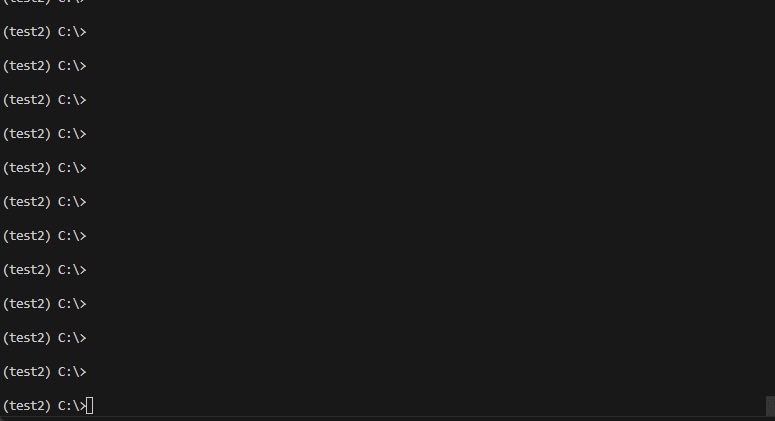
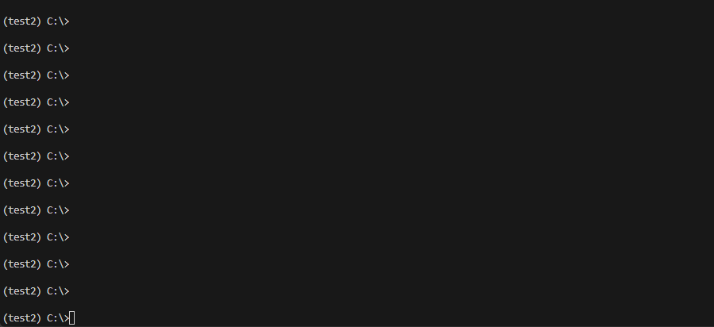

# PyDrama


**Pretend to be busy or waiting for your computer when you should actually be doing real work!** Impress people with your insane multitasking skills. Just open a few instances of `PyDrama` and watch the show. `PyDrama` has multiple scenes that pretend to be doing something exciting or useful when in reality nothing is happening at all.


Welcome to PyDrama, the ultimate simulation tool that spices up your terminal with a dash of developer drama! Whether you're coding in solitude or in a bustling open office, `PyDrama` adds that extra zing to your development life.






## Installation

Get ready to add some theatrics to your terminal with a simple pip command:

```bash
pip install pydrama
```

## Running PyDrama
To start PyDrama, run the following command in your terminal:

```
pydrama
```


#### Options
`-m, --modules`: Specify the modules to run (e.g., bootlog, ansible, cc). If omitted, PyDrama will run all modules in a loop.

Example:
```
pydrama -m bootlog,cc
```

**Available modules:**
`ansible`
`bootlog`
`docker_build`
`weblog`
`ocr_train`
`download`
`pip_install`
`cc`
 & more to be continued...


`--exit-after-time`: Exit PyDrama after running for a specified duration. Use format like 2h10min.

Example:

```
pydrama --exit-after-time 1h30min
```


`--exit-after-modules`: Exit PyDrama after running a specified number of modules.

Example:

```
pydrama --exit-after-modules 5
```

`-l, --list-modules`: List all available modules.
Example:

```
pydrama --list-modules
```


For a full list of commands and modules, and to get behind-the-scenes access, check out our Official Documentation.

## License

PyDrama is released under the MIT License, so feel free to use it, modify it, and share it with your fellow thespians!

 